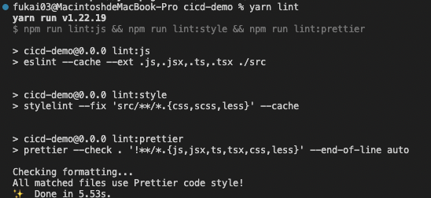
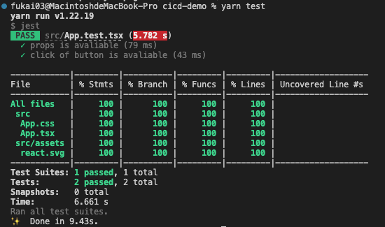
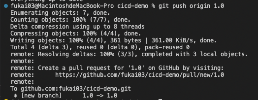
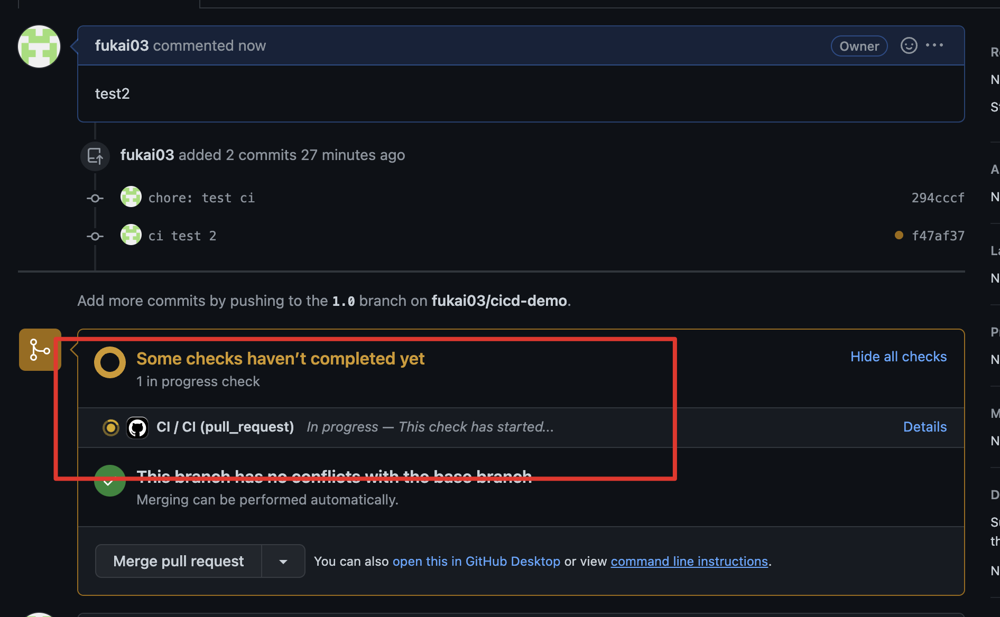
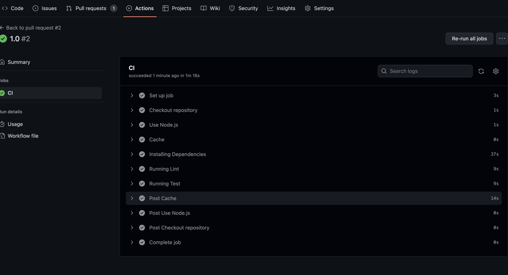
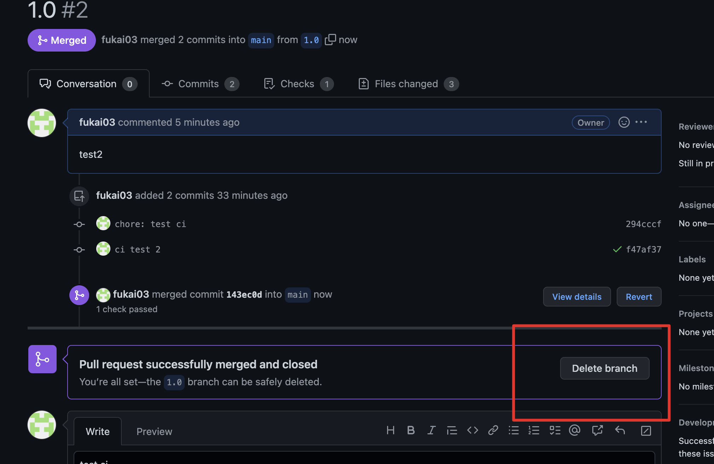

## CICD demo
demo：https://github.com/fukai03/cicd-demo
CI：
参考：https://juejin.cn/post/7156957907890733063#heading-75

github action：https://juejin.cn/post/7113562222852309023
* 对开源支持最友好
* 项目需放在github上

Workflow
* Event（触发事件）：指触发 Workflow(工作流程) 运行的事件
* Job（作业）：一个工作流程中包含一个或多个Job，这些Job默认情况下并行运行，但我们也可以通过设置让其按顺序执行。每个Job都在指定的环境(虚拟机或容器)里开启一个Runner(可以理解为一个进程)运行，包含多个Step(步骤)
* Step（步骤）：Job的组成部分，用于定义每一部的工作内容。每个Step在运行器环境中以其单独的进程运行，且可以访问工作区和文件系统。

添加CI流程
添加代码扫描

* 安装@umijs/fabric,使用umi中的代码扫描规则进行配置
```bash
yarn add @umijs/fabric -D
```
* 配置文件
  * .eslintrc.js
```js
module.exports = {
  extends: [require.resolve("@umijs/fabric/dist/eslint")],
};
```
* .prettierrc.js
```js
const fabric = require("@umijs/fabric");

module.exports = {
  ...fabric.prettier,
};
```
* .stylelintrc.js
```js
const fabric = require("@umijs/fabric");

module.exports = {
  ...fabric.stylelint,
};
```
* 在package.json中添加lint指令
```json  
  "scripts": {
    "lint": "npm run lint:js && npm run lint:style && npm run lint:prettier",
    "lint:js": "eslint --cache --ext .js,.jsx,.ts,.tsx ./src",
    "lint:prettier": "prettier --check . '!**/*.{js,jsx,ts,tsx,css,less}' --end-of-line auto",
    "lint:style": "stylelint --fix 'src/**/*.{css,scss,less}' --cache"
   },
```
* 运行 ```yarn lint``` ,查看代码扫描结果


添加自动化测试
* 添加单元测试
  * src/App.tsx
```tsx
import { useState } from 'react'
import reactLogo from './assets/react.svg'
import './App.css'

interface Props {
  value?: string;
}

const App: React.FC<Props> = ({value}) => {
  const [count, setCount] = useState(0)

  return (
    <div className="App">
      <div>
        <a href="https://vitejs.dev" target="_blank" rel="noreferrer">
          
        </a>
      </div>
      <h1>Vite + React</h1>
      <div className="card">
        <button onClick={() => setCount((e) => e + 1)} role="button">
          count is {count}
        </button>
      </div>
      <p role="props">{value}</p>
    </div>
  )
}

export default App
```

* 安装单元测试工具，添加以下工具库
```json
    "babel-preset-react-app": "^10.0.1",
    "jest": "^27.5.1",
    "jest-puppeteer": "^6.1.0",
    "puppeteer": "^14.4.0",
    "ts-jest": "^27.1.3",
    "@testing-library/jest-dom": "^5.16.2",
    "@testing-library/react": "^12.1.4",
    "@types/expect-puppeteer": "^5.0.0",
    "@types/jest": "^27.4.1",
    "@types/jest-environment-puppeteer": "^5.0.2",
```
* 添加test文件 src/App.test.tsx
```tsx
import React from "react";
import { render, screen, fireEvent } from "@testing-library/react";
import App from "./App";

test("props is avaliable", () => {
  const value = "123";
  // 为了多写点测试用例，我给App组件加了个prop
  render(<App value={value} />);
  expect(screen.getByRole("props")).toHaveTextContent(value);
});

test("click of button is avaliable", () => {
  render(<App />);
  fireEvent.click(screen.getByRole("button"));
  expect(screen.getByRole("button")).toHaveTextContent(`count is 1`);
});
```
* 添加文件src/setupTests.ts
``` ts
// jest-dom adds custom jest matchers for asserting on DOM nodes.
// allows you to do things like:
// expect(element).toHaveTextContent(/react/i)
// learn more: https://github.com/testing-library/jest-dom
import '@testing-library/jest-dom';
```
* 添加文件config/jest/basicTransform.js
```js
module.exports = {
    process() {
      return "module.exports = {};";
    },
    getCacheKey() {
      // The output is always the same.
      return "basicTransform";
    },
};
```
  
* 添加jest配置文件 jest.config.js
```js
/** @type {import('ts-jest/dist/types').InitialOptionsTsJest} */
module.exports = {
    globals: {
      'ts-jest': {
        babelConfig: {
          presets: ['react-app'],
        },
      },
    },
    setupFilesAfterEnv: ['<rootDir>/src/setupTests.ts'],
    testMatch: [
      '<rootDir>/src/**/__tests__/**/*.{js,jsx,ts,tsx}',
      '<rootDir>/src/**/*.{spec,test}.{js,jsx,ts,tsx}',
    ],
    testPathIgnorePatterns: ['<rootDir>/src/e2e/'],
    testEnvironment: 'jsdom',
    transform: {
      '^.+\\.(ts|tsx)$': 'ts-jest',
      '^.+\\.(css|svg)$': '<rootDir>/config/jest/basicTransform.js',
    },
    transformIgnorePatterns: [
      '[/\\\\]node_modules[/\\\\].+\\.(js|jsx|mjs|cjs|ts|tsx)$',
      '^.+\\.module\\.(css|sass|scss)$',
    ],
    collectCoverage: true,
    modulePaths: [],
    moduleFileExtensions: [
      'web.js',
      'js',
      'web.ts',
      'ts',
      'web.tsx',
      'tsx',
      'json',
      'web.jsx',
      'jsx',
      'node',
    ],
    resetMocks: true,
  };
```
* 以上文件配置好后，在package.json中添加test命令

```json
"test": "jest"
```
* 运行yarn test，结果如下：



配置CI Workflow
* 在根路径下添加 .github/workflows/ci.yml 文件
```yml
name: CI
# Event设置为main分支的pull request事件，
# 这里的main分支相当于master分支，github项目新建是把main设置为默认分支，我懒得改了所以就保持这样吧
on:
  pull_request:
    branches: main
jobs:
  # 只需要定义一个job并命名为CI
  CI:
    runs-on: ubuntu-latest
    steps:
      # 拉取项目代码
      - name: Checkout repository
        uses: actions/checkout@v2
      # 给当前环境下载node
      - name: Use Node.js
        uses: actions/setup-node@v3
        with:
          node-version: "16.x"
      # 检查缓存
      # 如果key命中缓存则直接将缓存的文件还原到 path 目录，从而减少流水线运行时间
      # 若 key 没命中缓存时，在当前Job成功完成时将自动创建一个新缓存
      - name: Cache
        # 缓存命中结果会存储在steps.[id].outputs.cache-hit里，该变量在继后的step中可读
        id: cache-dependencies
        uses: actions/cache@v3
        with:
          # 缓存文件目录的路径
          path: |
            **/node_modules
          # key中定义缓存标志位的生成方式。runner.OS指当前环境的系统。外加对yarn.lock内容生成哈希码作为key值，如果yarn.lock改变则代表依赖有变化。
          # 这里用yarn.lock而不是package.json是因为package.json中还有version和description之类的描述项目但和依赖无关的属性
          key: ${{runner.OS}}-${{hashFiles('**/yarn.lock')}}
      # 安装依赖
      - name: Installing Dependencies
        # 如果缓存标志位没命中，则执行该step。否则就跳过该step
        if: steps.cache-dependencies.outputs.cache-hit != 'true'
        run: yarn install
      # 运行代码扫描
      - name: Running Lint
        # 通过前面章节定义的命令行执行代码扫描
        run: yarn lint
      # 运行自动化测试
      - name: Running Test
        # 通过前面章节定义的命令行执行自动化测试
        run: yarn test
```
* 本地新建新分支 1.0

```bash
git checkout -b 1.0
```
* 在该分支进行修改后提交，创建pull request



* github中在pull request中运行如下



* 可在actions中查看CI具体流程



* 确认代码安全可靠后就可以点击Merge pull request来把新代码集成到主干上。从而基于CI完成一次bug 修复或新特性迭代。
* 合并成功后，可以点击Delete branch以删除已合并的特性分支。



添加CD流程
CD指的是 持续交付（Continuous delivery） 或者 持续部署（continuous deployment） 或者是两者的并集
* Amazon AWS对CD的解释：https://aws.amazon.com/cn/devops/continuous-delivery/
* redHat 对CICD解释：https://www.redhat.com/zh/topics/devops/what-is-ci-cd
* 采用持续交付时，系统会构建并测试每一个代码变更，然后将其推送到非生产测试环境或临时环境中。生产部署前可能存在多个并行测试阶段。持续交付与持续部署之间的区别在于：持续交付需要手动批准才能更新到生产环境。对于持续部署，生产会在没有明确批准的情况下自动发生。

从上图中可知CD有三个步骤：
1. 生成制品
2. 自动部署到测试环境以校验其稳定性
3. 部署到生产环境（自动的是持续部署，手动的是持续交付）
